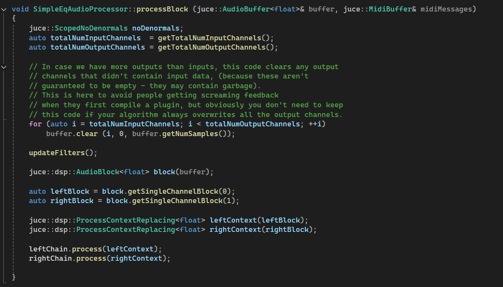

import Callout from "@/components/Callout.astro";

---

!!!! WIP !!!!
TODO:
- need to change title & description to something more relevant, use current title and desc
	for next post
!!!!!!! 

## What?
This is a blog for me to record thoughts/progress/etc. on music, vst stuff, other projects, etc
focusing on my music / vst learnings for now

## Why?

I've been making music on the computer in my free time for almost a decade now, I don't have much formal education
on the subject, but I'm learning and enjoying the process every day. I started
posting some little sample based beats and song ideas online this past year at [SOUNDCLOUD LINK].
Seeing a few people from across the globe listen to the releases has been a fun experience.

It's all just been for fun thus far! So, I've spent probably 95% of the time playing around and
experimenting vs. 5% studying or learning audio engineering best practices or techniques. 

Now that I've been at it for a while, I'm noticing more and more the myriad ways
in which the songs I'm making often do not sound as professional (i.e. good, listenable, enjoyable, interesting)
as many musicians/producers/audio engineers I admire. 

In order to keep growing as an artist I'd like to learn some new skills and improve current ones in a few areas I struggle in.
I could spend a lot of time talking about those areas, but it generally comes down to:

	- 1. composition (theory, melody, harmony, structure, instrumentation, voicing, variety, musical complexity)
				- I have never spent much time learning how to write music for any
					instrument! I'm a mediocre drummer and a self taught guitar player.
					It would be generous to say that I have a basic understanding of music theory.
				- deciding which notes/chords a given instrument will play and when
					(writing music in general) is a struggle
				- my written parts are often extremely simple/boring
				- being more intentional/informed about which instrument I use for which
					part and understanding the conotations/implications of different instruments
				- I have never been very intentional about song structure, usually let
					projects come together gradually without much planning.
						- how should this song be structured to acheive a given aim
				- not enough subtle variation over the course of a song 
	- 2. loudness (clarity, dynamics, energy level)
				- gain staging? never heard of it
				- vague understanding of how to use compressors, limiters,
					other plugins meant for controlling volume or relative volume
					of sonic elements
				- avoiding muddy sounding parts and freq ranges
				- lufs vs dbfs?
	- 3. polish (effects, transitions, best practices, sound design)
				- understanding how a specific effect functions well enough to use it without
					presets or too much experimentation, understanding relevant best practices
					and why they are best practices 
				- knowledge of which effects can be used to solve a given problem, achieve a
					specific sound, complement another element, etc.. and how to go about it
				- how to go about creating interesting/different sounds
				- finding creative ways to transition between sections

### improving composiiton
	- talk about composition lessons
	- talk about being intentional about using less samples/more selfwritten parts
	- talk about being more intentional about planning song structure 
	- talk about being more intentional about planning instrumentation
	- how the processes of Composition, Arrangement, Sound Design, Mixing,
		Mastering (lite), influence eachother and become one processess
	- talk about writing songs w band
	- expand to do more traditional composition too? who knows
	- anything else to add here?

### improving loudness & polish 
- talk about electronic music class at carleton
- talk about steve duda video
- talk about pitcher a tiny bit
- talk about how VST building will help 2 & 3
- talk about why vst building vs max vs puredata etc
- talk about how why not just watch tutorials on youtube or ask chatgpt
- anything else to add?

### WHY A BLOG?
	- keep me honest
	- share learning experience, maybe helpful to others
	- write a little bit every couple days, at least once a week
	- maybe will end up writing about more topics afterwards
	- anything else?

!!!!!!!!!! BELOW GOES IN NEXT "First Steps" ARTICLE !!!!!!!!!!!!!

## Initial Research

- Iplug2 vs Juce vs Cabbage vs nih-plug

## First Project
- Simple EQ

Todo

some changes

image example

